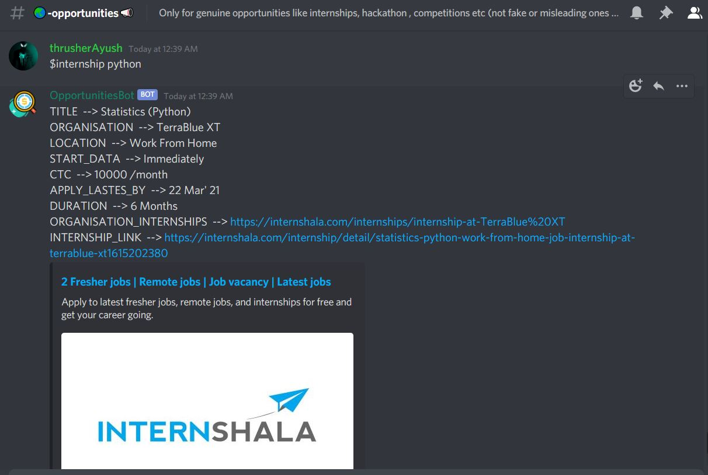

## Opportunities Bot Discord
This bot can extract the internship posts from the internshala and store in the repl database and gives response when asked.

### Preview : - 

#### Features : -
1. Accurate Data
2. Reset Feature to clear the database.
3. Fast and reliable
4. Structured Data
5. Internship and Freelancing Feature

#### How to play with bot :- 
<li>Type command <code>$help</code> to get started</li>
<li>Type <code>$internship field_name</code> like <code>$internship python</code> to get internship regarding particular field</li>
<li>Type <code>$freelance</code> to get random freelance work</li>
<li>Type<code>$freelance field_name</code> like <code>$freelance python</code></li>
##### Note : - 
All changes are most welcomed. Please feel free to make pull request or raise issues.

##### Last Updated : -
12 March 2021